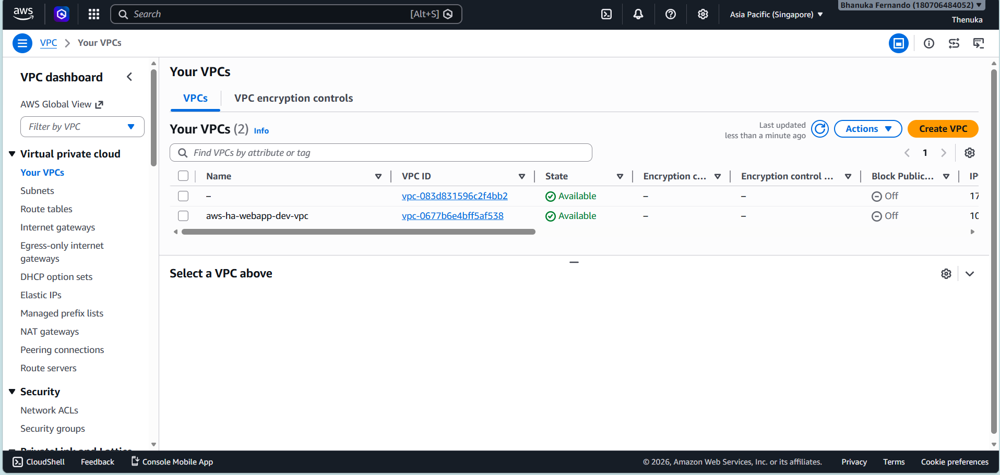
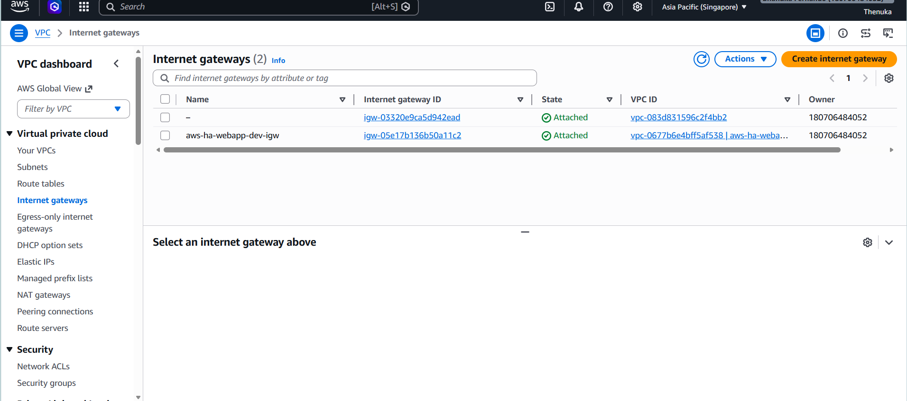
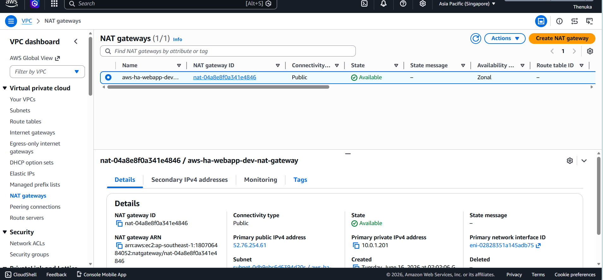
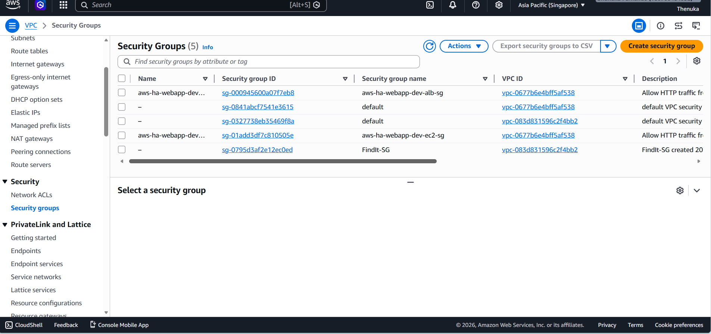
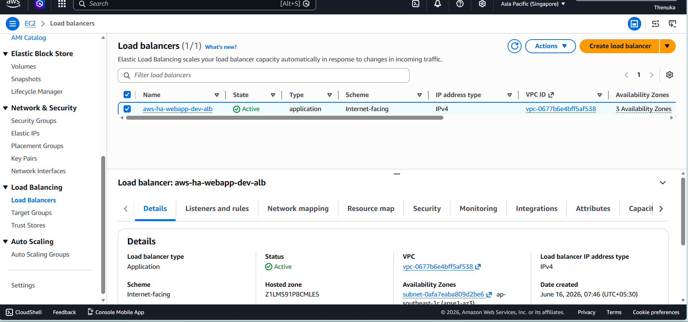
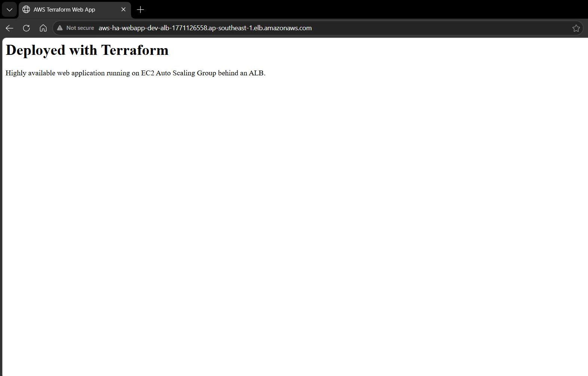
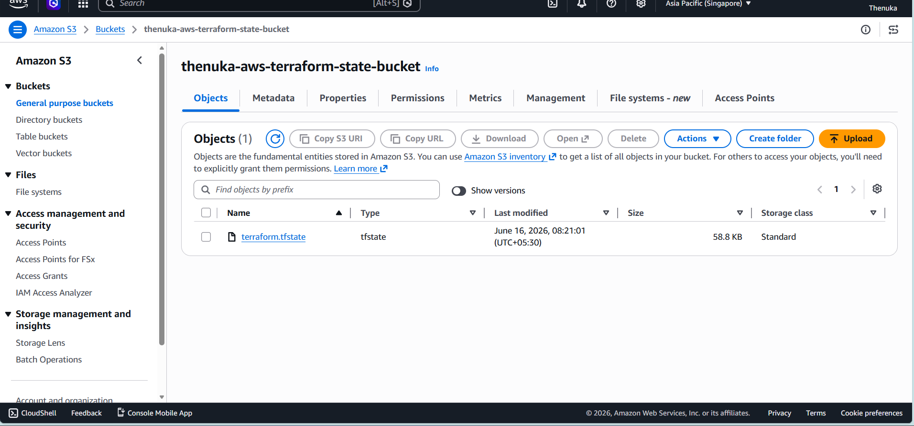
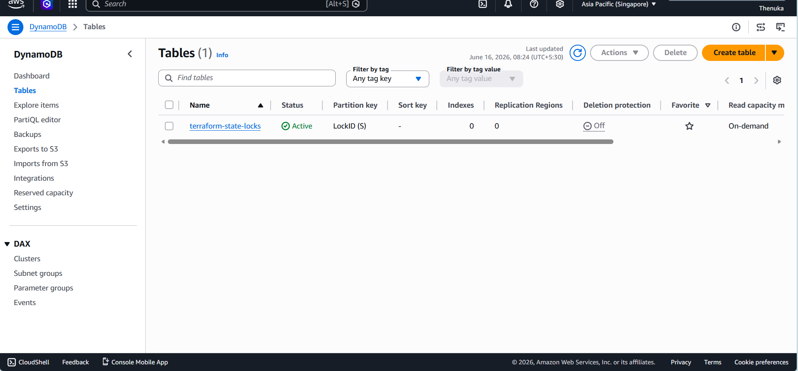

# AWS Highly Available Web Application using Terraform

## Project Overview

This project provisions a highly available AWS infrastructure using Terraform.

The architecture follows Infrastructure as Code (IaC) principles and deploys a web application behind an Application Load Balancer using an Auto Scaling Group.

The Terraform state is stored remotely in Amazon S3 with DynamoDB state locking.

Networking:
- VPC
- Public Subnets
- Private Subnets
- Internet Gateway
- NAT Gateway
- Route Tables

State Management:
- S3 Backend
- DynamoDB Lock Table
```

---

## Technologies Used

- Terraform
- AWS VPC
- AWS EC2
- AWS Auto Scaling
- AWS Application Load Balancer
- AWS S3
- AWS DynamoDB
- Git
- GitHub

---

## Project Structure

```text
AWS-Terraform/
│
├── backend-setup/
│   ├── main.tf
│   ├── outputs.tf
│   └── providers.tf
│
├── modules/
│   ├── alb/
│   ├── ec2/
│   ├── s3/
│   ├── security-groups/
│   └── vpc/
│
├── main.tf
├── variables.tf
├── outputs.tf
├── providers.tf
├── terraform.tfvars
└── README.md
```

---

## Features

### Networking

✔ Custom VPC

✔ 3 Public Subnets

✔ 3 Private Subnets

✔ Internet Gateway

✔ NAT Gateway

✔ Public Route Table

✔ Private Route Table

---

### Security

✔ ALB Security Group

✔ EC2 Security Group

✔ Controlled Ingress Rules

---

### Load Balancing

✔ Application Load Balancer

✔ HTTP Listener

✔ Target Group

---

### Compute

✔ Launch Template

✔ Auto Scaling Group

✔ Amazon Linux 2023

✔ User Data Script

---

### Remote State Management

✔ S3 Backend

✔ Versioning Enabled

✔ Server Side Encryption

✔ DynamoDB State Locking

---

## Deployment Steps

### Initialize Terraform

```bash
terraform init
```

### Validate Configuration

```bash
terraform validate
```

### Review Changes

```bash
terraform plan
```

### Deploy Infrastructure

```bash
terraform apply
```

### Destroy Infrastructure

```bash
terraform destroy
```

---

## Screenshots

### VPC



---

### Subnets


---

### Internet Gateway



---

### NAT Gateway



---

### Security Groups



---

### Application Load Balancer



---

### Web Application



---

### S3 Backend



---

### DynamoDB Lock Table



---

## Terraform State Backend

S3 Bucket:
```

thenuka-aws-terraform-state-bucket

```

DynamoDB Table:
```

terraform-state-locks

```

---

## Learning Outcomes

- Infrastructure as Code (IaC)
- Terraform Modules
- AWS Networking
- Load Balancing
- Auto Scaling
- Remote State Management
- State Locking
- Git & GitHub Integration

---

## Author

Thenuka Rathnamalala

DevOps Enthusiast | AWS | Terraform | GitHub